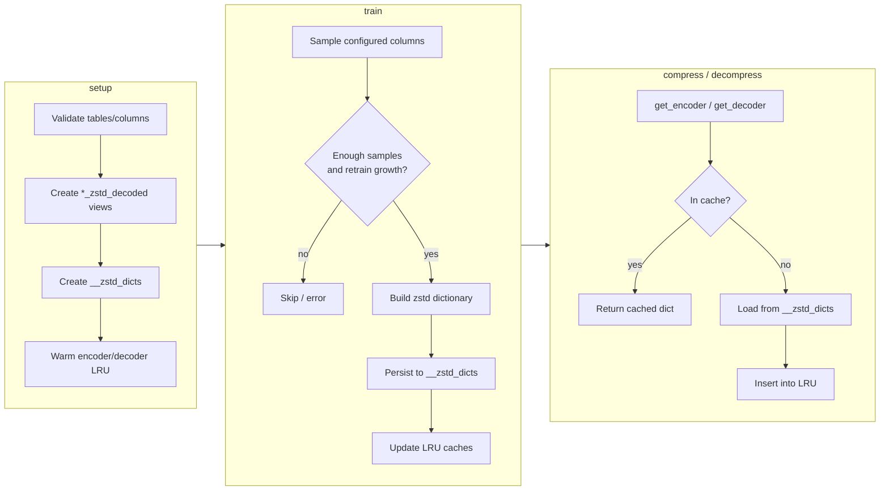

# sqlite-compress

Rust library for **zstd dictionary compression** on SQLite blob columns. It trains dictionaries from your data, stores them in SQLite, caches encoders/decoders in memory, and sets up decode views over compressed tables.

## Features

- **Setup** — per schema, create `__zstd_dicts` and `*_zstd_decoded` views, then warm the dict cache
- **Train** — sample configured columns, build a zstd dictionary, persist it, update LRU caches
- **Encode / decode** — `get_encoder` / `get_decoder` with process-wide LRU caches
- **DB-agnostic traits** — `DictStore` / `SetupConnection` so callers can wrap any SQLite connection

## Quick start

### What `setup` does

1. Ensures each configured table/column exists
2. Creates `{table}_zstd_decoded` views (idempotent)
3. Creates `__zstd_dicts` in each schema (`id`, `dict`, `trained_at`, `row_count`)
4. Warms encoder/decoder caches from the latest dictionary (if any)

### What `train` does

1. Validates config (capacity, tables, columns)
2. Checks there are enough samples and enough growth since the last train
3. Builds a dictionary from sampled blobs
4. Persists it into `__zstd_dicts` and syncs LRU caches

### Runtime workflow (setup → train → use)

